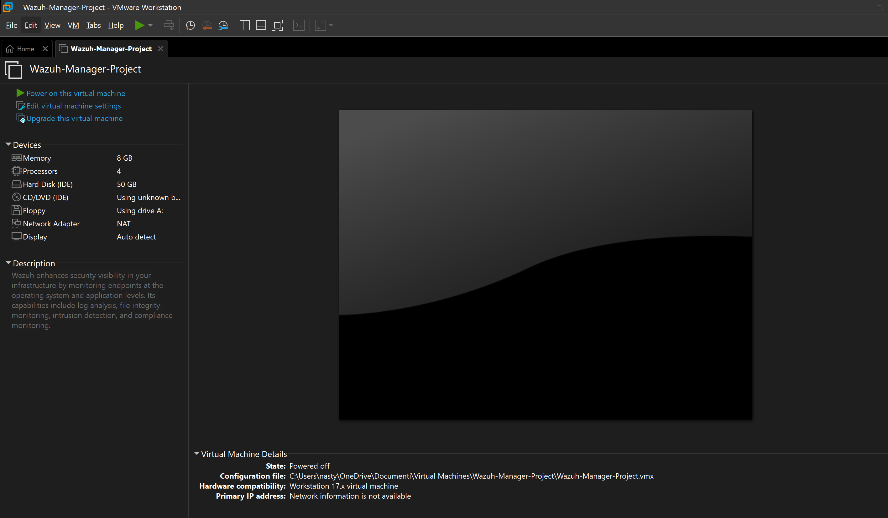
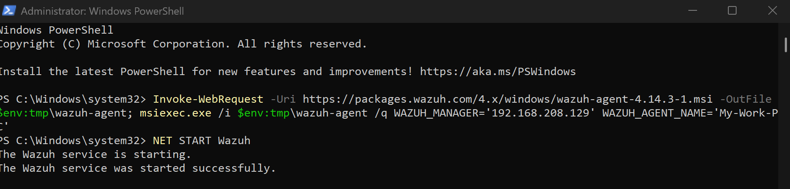
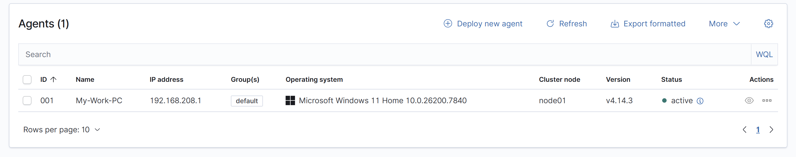
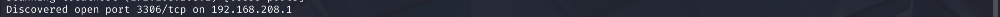
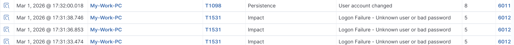

# 🛡️ Wazuh SIEM Lab: Threat Detection & MITRE ATT&CK Analysis

## 🚀 Project Overview
This repository documents my hands-on laboratory project focused on deploying and testing **Wazuh SIEM**. I simulated real-world attacks using **Kali Linux** against a **Windows 11** endpoint to analyze detection capabilities and forensic log integrity.

## 🏗️ Lab Infrastructure
The environment was built using **VMware Workstation** with a host-only network.
* **Wazuh Manager:** Ubuntu-based OVA (IP: `192.168.208.129`).
* **Victim Node:** Windows 11 Home with Wazuh Agent installed.
* **Attacker Node:** Kali Linux 2025.2.

---

## 🔍 Key Project Phases

### Phase 1: Agent Deployment
I deployed the Wazuh Agent on the Windows machine using a **PowerShell** automated script. After installation, I verified the agent's status in the dashboard to ensure real-time telemetry flow.

### Phase 2: Network Reconnaissance (Nmap)
Using **Nmap** from the Kali machine, I performed a full port scan to find entry points.
* **Discovery:** The scan identified an open **MySQL port (3306)**.
* **Detection:** Wazuh flagged the activity. While the dashboard auto-mapped this to Defense Evasion, I manually verified it as **MITRE T1046 (Network Service Scanning)** under the Discovery tactic.

### Phase 3: Brute-Force & Account Manipulation
I simulated a dictionary attack using **Hydra** and manually triggered high-severity events on the Windows host.
* **Hydra Attack:** The attempt was blocked with **Error 1130** due to secure MySQL configuration.
* **Internal Alerts:** Wazuh generated **Level 5** alerts for failed logins and a **Level 8** critical alert for "User account changed."

### Phase 4: Analyst Insight & Corrections
I audited the automatic MITRE mapping to ensure analytical accuracy:
* **Correction:** Reclassified failed logins from "Impact" to **Credential Access (T1110)**.
* **Refinement:** Mapped account changes specifically to **Account Manipulation (T1098)** within the Persistence tactic.

---

## 🛠️ Critical Troubleshooting: The Time Drift Case
The most significant challenge was a **6-hour time difference** between the attacker (Kali) and the manager, causing events to disappear from real-time views.
* **Solution:** Reconfigured the time zone and enabled **NTP synchronization** on Kali Linux.
* **Takeaway:** Correct timestamps are vital for forensic timeline integrity and accurate incident response.

---

## 🎓 Conclusion
This lab provided practical experience in SIEM administration and threat hunting. I learned how to interpret raw logs, correct automated security frameworks, and solve technical synchronization issues that are critical in a professional SOC environment.
